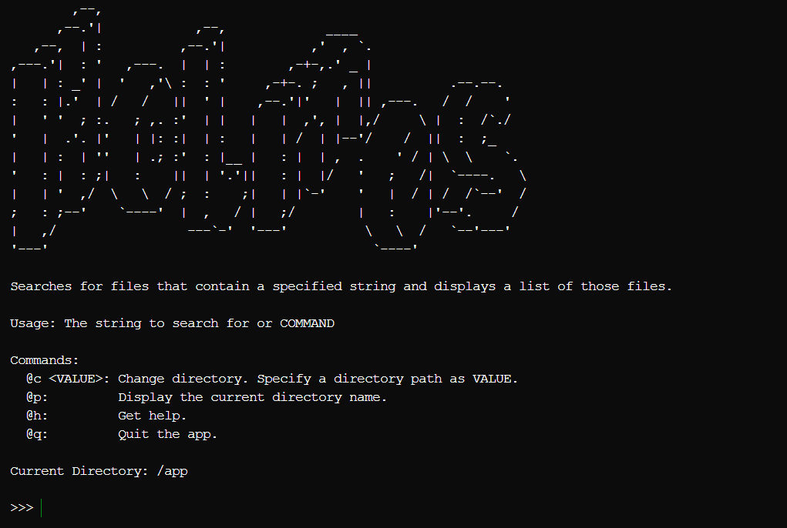

# Holmes - ファイル検索アプリ

現在のディレクトリ内で、指定した文字列を含むファイルを検索して一覧表示する。



## 使用方法

検索したい文字列またはコマンドを入力する。

### コマンド一覧:

- @c <VALUE>: ディレクトリを移動する。`VALUE`には、移動先のディレクトリを入力する。 
- @p:         現在のディレクトリを表示する。
- @h:         ヘルプを表示する。
- @q:         アプリを終了する。

## ビルド方法

```bash
$ go build -o holmes cmd/holmes/main.go
```
